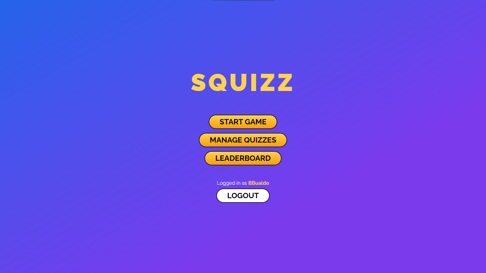
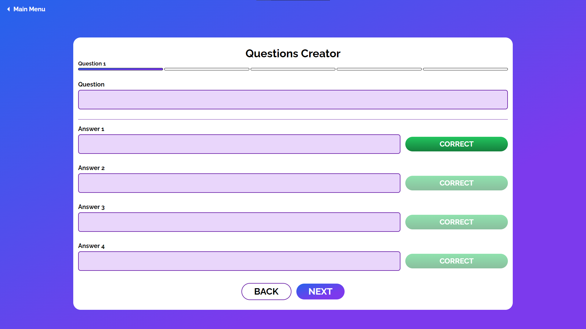
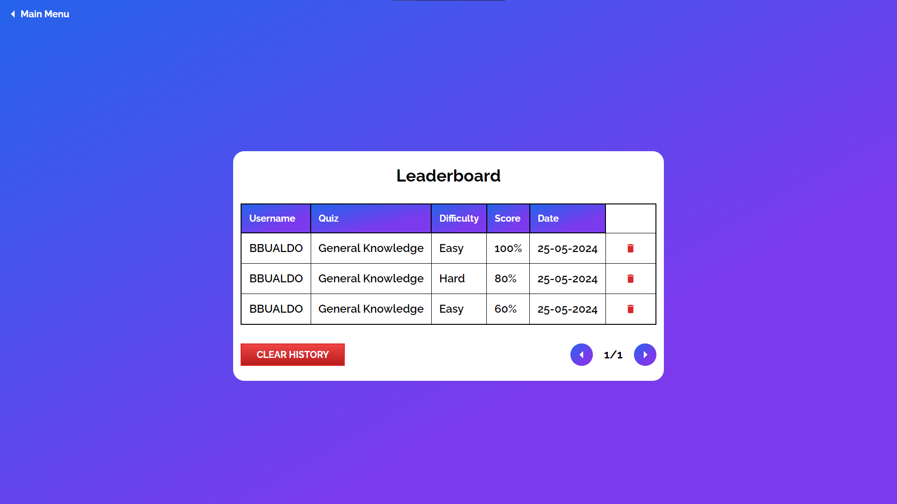
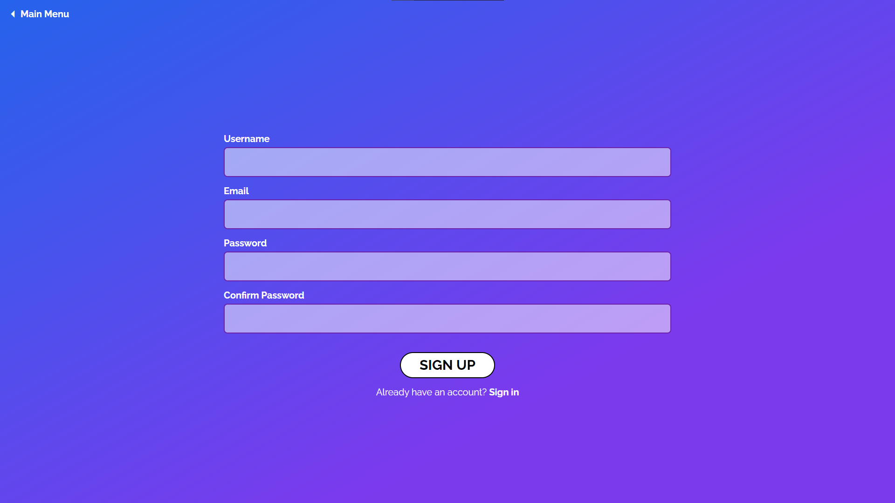
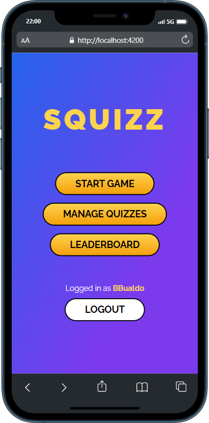
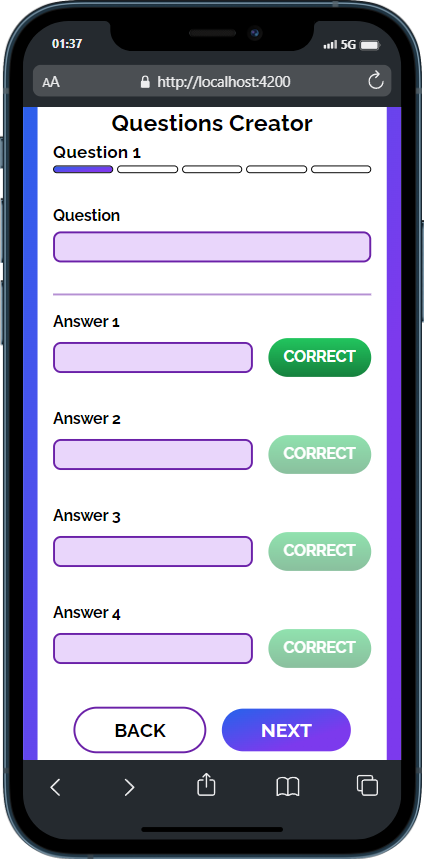
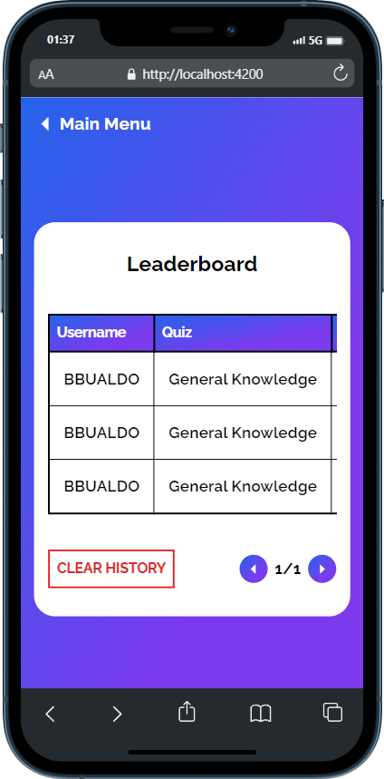
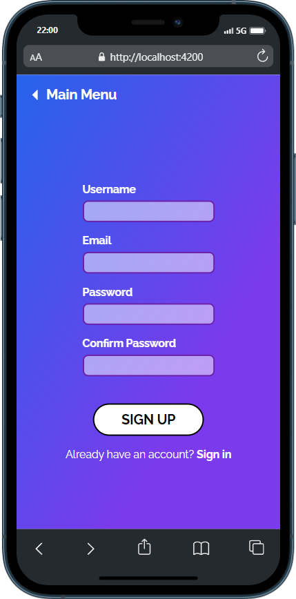

# Quiz Game

Application where user can create his own Quizzes play them and track scores in leaderboard.</p>

## 📸 Screenshots
<div>
<h3>Desktop</h3>




</div>
<div>
<h3>Mobile</h3>




</div>


## 🧐 Features

Here're some of the project's best features:

*   Creating Quizzes (choosing name selecting number of questions)
*   Playing Quizzes (with username input quiz and difficulty level selection)
*   Animated timer based on selected difficulty
*   Saving records in leaderboards
*   Ability to delete Quiz or Game(s)
*   User-Friendly error and loading handling
*   Authentication and Authorization
*   Authenticated users can delete and create Quizzes/Games

## 🛠️ Installation Steps:

1. Go to **appsettings.json** and replace **ConnectionString:Default** with your connection string.

``` appsettings.json
"ConnectionStrings": { 
"Default": "your_connection_string" 
}
```

2. In **Program.cs** change DbContext options to your Database Provider


``` Program.cs 
builder.Services.AddDbContext(options => 
{ 
options.YOUR_DATABASE(builder.Configuration.GetConnectionString("Default")); 
});
```

3. Open **NuGet Package Manager Console** and run:

```
Add-Migration Initial
Update-Database
```

4. In UI folder go to **config** folder and change url:

``` config.ts
export const url = 'https://localhost:{your_port}/api/';
```

5. In UI folder run:

```
npm install
```

## 💻 Built with

*   Angular
*   TypeScript
*   ASP.NET Core
*   Entity Framwork Core
*   PostgreSQL
*   Angular Material
*   TailwindCSS
*   ASP.NET Identity
*   Logger

## 🧠 What I've learned

* Children Routing to organize layout for component groups
* Solid grasp on RxJS Observable Pattern concept
* Keeping possible losable progress using localStorage (Quiz Creator Stepper, Quiz Session Creator)
* Mapping through related tables using Entity Framework
* Server-Side Pagination
* Handling loading state and potential errors
* Handling Authentication and Authorization using ASP.NET Core Identity
* Logging errors in Database using ILogger
* Storing token in cookies on Authentication