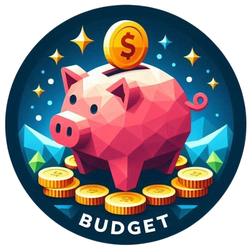
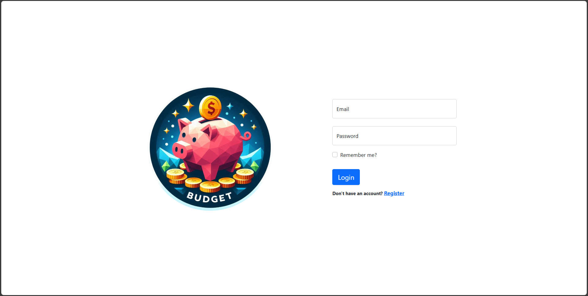
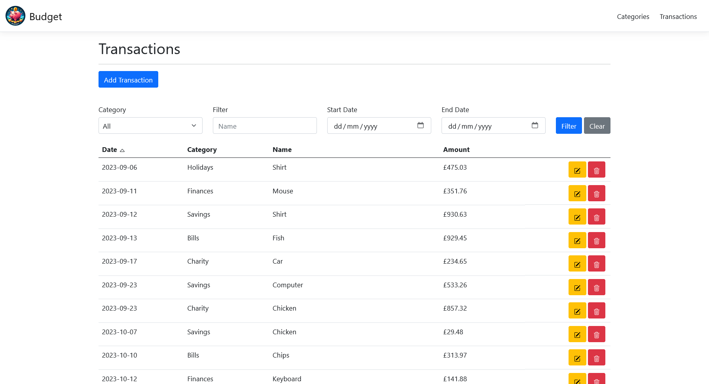
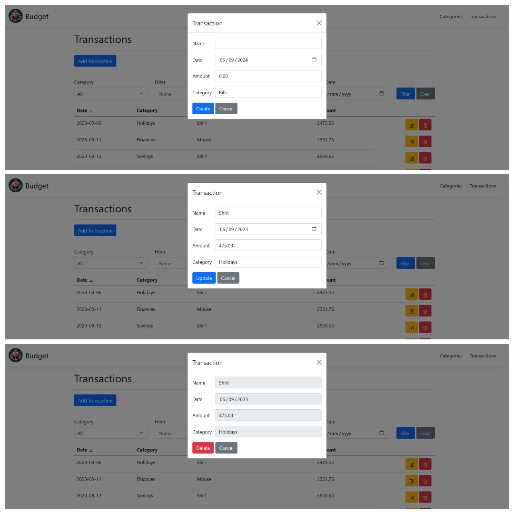
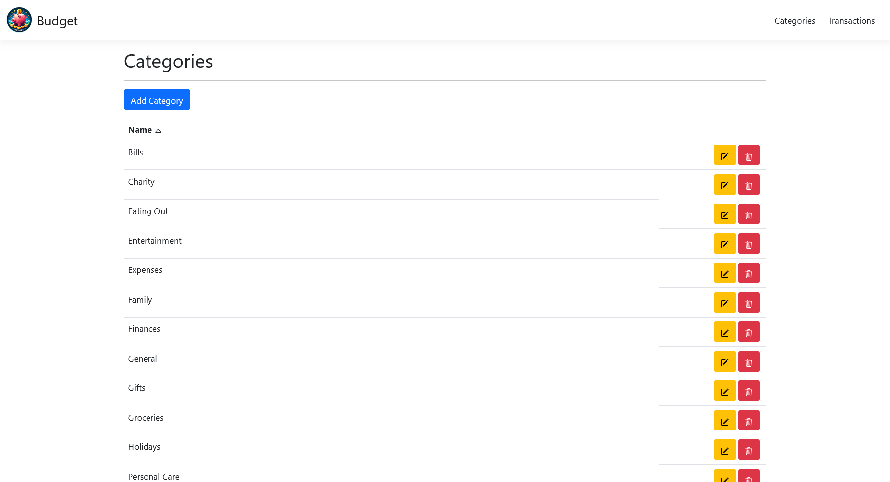
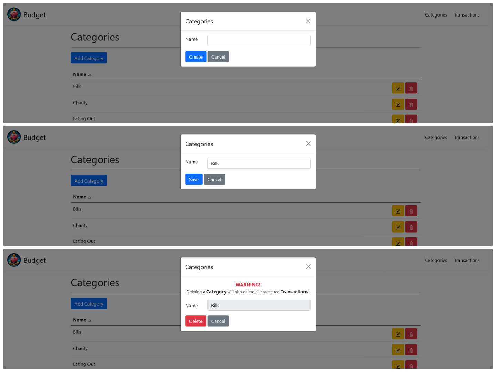
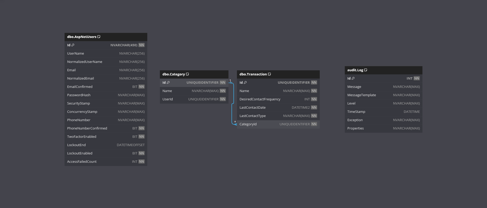

	
	<h1>Budget</h1>

Welcome to the **Budget** App!

This is a .NET project designed to demonstrate implementing an authentication and authorisation system.

It allows users to register/login and manage their budgets. They can view and record what transactions they have made. They can filter by Category, Name, and Date.

The web front end is delivered by Microsoft ASP.NET MVC and utilises Bootstrap for styling.
There is an integrated SQL Server database in the back end.

## Requirements

This application fulfills the following [The C# Academy - Authentication and Authorization](https://thecsharpacademy.com/project/28/authentication-and-authorization) project requirements:

- [x] In this project, you'll have two tasks.
- [x] In a first moment you'll create a new Web App project with Identity as part of it.
- [x] In a second moment you'll scaffold Identity into the Movies App you created before. If you haven't done the Movies app, you can scaffold it into a project of your choice. This is the only project you need to submit for review.
- [x] You need to use Entity Framework, raw SQL isn't allowed.
- [x] You need to seed test data.
- [x] You need to use EF's EnsureCreated method so the database and tables are created automatically.
- [x] You need to add logging logic to your app and save logs to your database when errors occur.
- [x] You don't need to handle auth scenarios such as e-mail confirmation, password recovery, etc. These will be addressed in future projects.

## Features

- **Blazor**:
  - The web front end has been built with Microsoft ASP.NET MVC.
- **Bootstrap**:
  - The web UI is styled using Bootstrap v5.1.0.
- **Transactions**: 
	- Create, view, update and delete Transactions. Create/Update/Delete are modal forms!
- **Categories**: 
	- Create, view, update and delete Categories. Create/Update/Delete are modal forms! Be careful, deleting a Category deletes all associated Transactions!!
- **Filtering**: 
	- Filter Transactions by their Name and/or Date and/or Category.
- **Responsive Web Design**:
	- A user-friendly web interface has been designed to work on various devices.
- **Entity Framework Core**:
  - Entity Framework Core is used as the ORM.
- **SQL Server**:
  - SQL Server is used as the data provider.
- **Database Seeding**: 
	- Creates database if required.
	- Creates an Admin and User account for testing.
	- Inserts fake initial data for testing.
- **Database Logging**: 
	- Serilog MSSqlServer sink is used to log to the audit database.
- **Identity**: 
	- ASP.NET Core Identity is utilised for authentication and authorisation.

## Technologies

- .NET
- ASP.NET MVC
- Entity Framework Core
- SQL Server
- Bootstrap
- HTML
- CSS
- JavaScript

## Getting Started

**IMPORTANT!**

The `InitialCreate` database migration has been created.

On start-up of the **Web** application, any required database creation/migrations will be performed.

### Prerequisites

- .NET 9 SDK.
- An IDE (code editor) like Visual Studio or Visual Studio Code.
- SQL Server.
- A database management tool (optional).

### Installation

1. Clone the repository:
	- `git clone https://github.com/chrisjamiecarter/budget.git`

2. Navigate to the project directory:
	- `cd src\budget\Budget.Web`

3. Configure the application:
	- Update the connection string in `appsettings.json` if you require.

4. Build the application using the .NET CLI:
	- `dotnet build`

### Running the Application

1. Run the application using the .NET CLI in the project directory:
	- `dotnet run`

## Usage

Once the application is running, you can:

- Register / Login.
	- Two accounts are created on inital startup for easy testing
		- Username: `admin@email.com` | Password: `adminADMIN123;'#`
		- Username: `user@email.com` | Password: `userUSER123;'#`
- View Transactions or switch to Categories via the navigation bar.
- Filter transactions using the filter options.
- Create/Update/Delete records by clicking on the associated icons/buttons.

### YouTube Demonstration

Please refer to the short YouTube video demonstration below:

### Transactions Page

### Categories Page

## How It Works

- **Web Project**: Uses Microsoft ASP.NET MVC, JavaScript and html pages to allow users to navigate the application.
- **Web Design**: This project uses Bootstrap v5.1.0 to style the app and provide a responsive web design.
- **Data Storage**: A new SQL Server database is created and the required schema is set up at run-time, or an existing database is used if previously created.
- **Data Access**: Interaction with the database is via Entity Framework Core.
- **Data Seeding**: The [Bogus](https://github.com/bchavez/Bogus) library is used to generate fake transaction data.
- **Data Logging**: The [Serilog](https://serilog.net/) MSSqlServer sink is used to add audit logs to the database.

## Project Architecture

The project follows the principles of **Clean Architecture**, promoting separation of concerns and making the system easier to maintain and test.

The solution is organized into the following layers:

- **Domain Layer**:
	- Contains the business models (entities) and defines any interfaces required to be implemented in the application layer.

- **Application Layer**:
	- Implements all application concerns and defines any interfaces required to be implemented in the infrastructure or presentation layer.

- **Infrastructure Layer**:
	- Implements all infrastructure concerns.

- **Presentation Layer**:
	- Implements all presentation concerns.
	- On startup, calls each layers install method.

This structure ensures that:
- Separation of Concerns: Each layer has a distinct responsibility.
- Testability: Layers can be tested in isolation.
- Maintainability: Changes in one layer have minimal impact on others.
- Scalability: New features can be added with minimal disruption.

## Database

---
***Happy Budgeting!***
